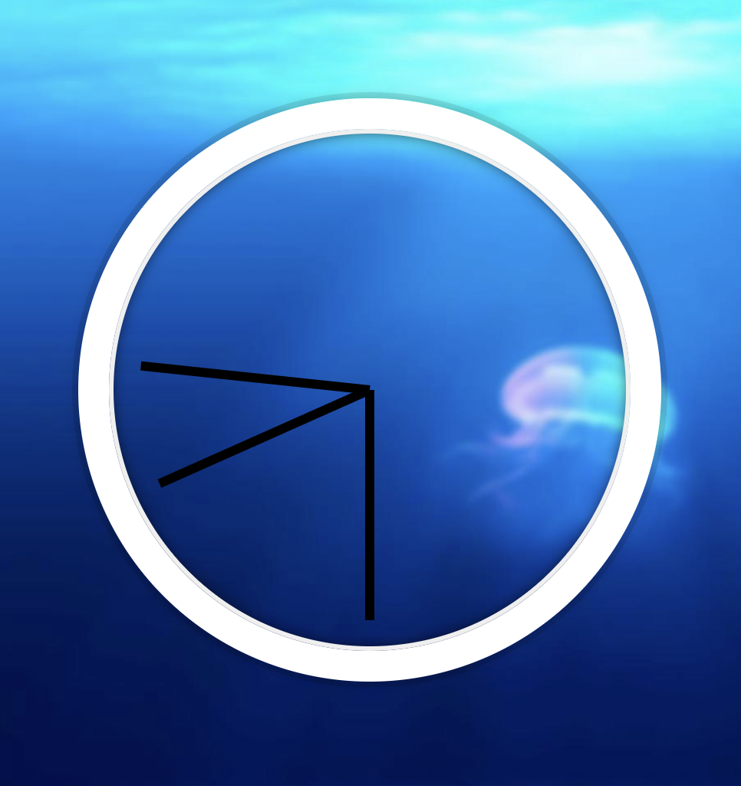
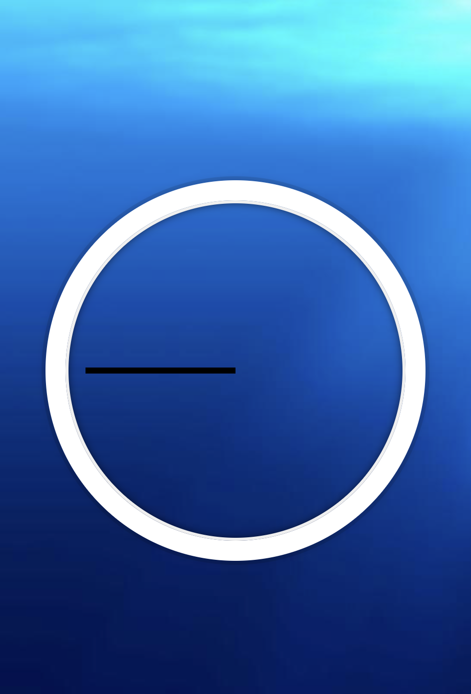

# [javascript30- 02 - JS and CSS Clock]((https://javascript30.com))

## Challenge

- make a clock with seconds hand, minutes hand and  hours hand

- [Solution URL](https://github.com/edpau/JS30_02-JS-and-CSS-Clock)
- [Live Site URL](https://edpau.github.io/JS30_02-JS-and-CSS-Clock/)

## What I learn 
### 1. transform: translateY(-3px); in clock-face
The CSS property `transform: translateY(-3px);` on `.clock-face` adjusts the vertical positioning of the clock hands. The hands are positioned at `top: 50%`, which places their top edge in the middle of the clock face. Since the hands have a height of `6px`, this means they extend `3px` above and below the middle point. The `translateY(-3px)` moves the hands up by `3px`, centering them perfectly. This tweak ensures the hands are visually aligned with the clock’s center.

### 2. transform-origin
- By default `transform-origin` is set to 50%
- `transform-origin: 100%;` by setting it to 100% along the x-axis, we shift the rotation origin to the end of the hand, so the hand rotate just like a clock

### 3. glitch when each hand complete a full rotation and reset from 450° back to 90°.
- Take second hand for example 
- End of the 60th second:
`secondsDegrees = (60 / 60) * 360 + 90 = 450°`

- Beginning of the next cycle (0th second):
`secondsDegrees = (0 / 60) * 360 + 90 = 90°`

- The browser tries to animate the transition between 450° and 90°, but instead of making a full backward rotation, it takes the shortest path — which visually appears as a sudden jump.

- Solution (same with other hands)
`const secondsDegrees = ((seconds / 60) * 360 + 90) % 360;`
    - 450 % 360 = 90
    - 90 % 360 = 90
    - 250 % 360 = 250
    so the degree at the end of the cycle will not be different to the beginning of the next cycle

## Step by step
1. Create the clock with HTML and CSS

2. Set all the hands rotate origin to the end of the hand
3. Rotate all the hands 90 degree (CSS `transform: rotate(90deg);`)
4. Set transition `transition: all 0.05s;` and `transition-timing-function: ease-in-out;`
5. Write a function to transform each hand with the corresponding time degree 
6. Use setTimeInterval to call the function every second
